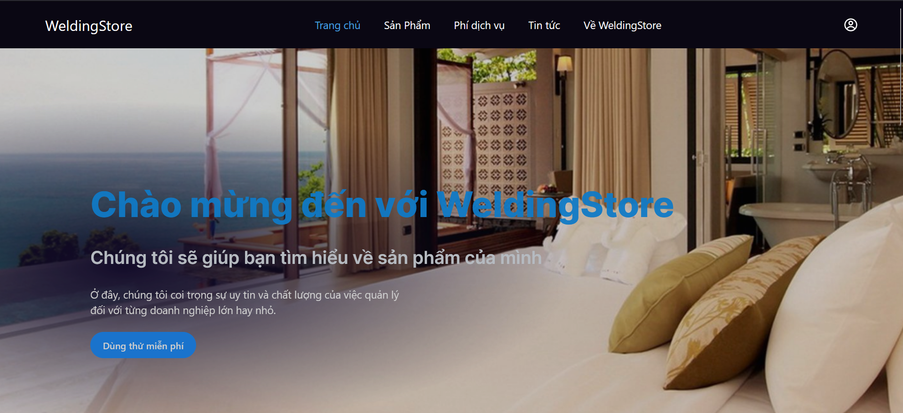
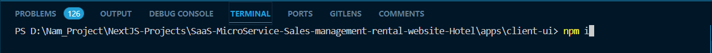
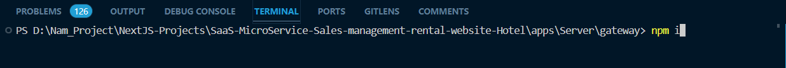
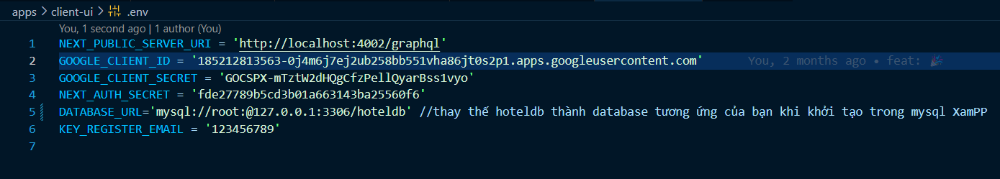

# WebSite Quản lý chuỗi khách sạn sử dụng Nest.js, GraphQL, Next.js, Prisma, SlimPHP

Chào mừng đến với Website mã nguồn mở Quản lý chuỗi Khách Sạn Welding Store của chúng mình, mục tiêu dự án này là làm ra dự án để quản lý phòng cũng như hàng hóa, hàng tồn kho. Quyền sẽ được phân chia cho Admin, Lễ Tân. Tất cả folder dự án sẽ được tự do truy cập, và file Readme ở đầu chính là file khởi tạo nhằm mục đích giới thiêu qua về website

## Cách cài đặt

### về phía máy client

B1: mở Terminal mới từ folder gốc rồi gõ lệnh: cd/apps/client-ui

B2: gõ lệnh: npm i như phía dưới

B3: Làm theo [Client_ReadMe](https://github.com/DoNhatNam1/SaaS-MicroService-Sales-management-rental-website/blob/Hotel_Branch/apps/client-ui/README.md)

### về phía máy chủ Server

B1: mở Terminal mới từ folder gốc rồi gõ lệnh: cd/apps/Server/gateway

B2: gõ lệnh: npm i như phía dưới

B3: Làm theo [Server_ReadMe](https://github.com/DoNhatNam1/SaaS-MicroService-Sales-management-rental-website/blob/Hotel_Branch/apps/Server/gateway/README.md) 

### Lưu ý: 

Nhớ phải cài đặt sẵn NodeJS trong thiết bị và mở chạy cả 2 cmd client và server để khơi chạy dự án

Nhớ thay thế các config trong file .env của cả 2 folder client-ui và Server để phù hợp với database của bạn
